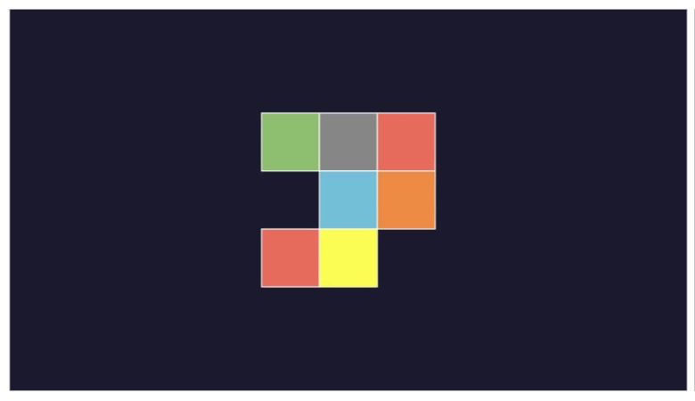
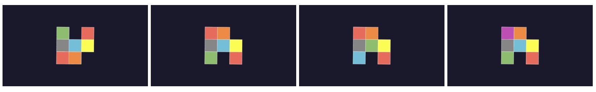

# 2D Rotation Test Manim synthesization

## Task Definition

2D Rotation Test refers to: Given a connected 2D grid with 4 other grids with different patterns of colors and textures, identify the one that is equivalent to the original grid under a certain rotation.
For example, the second choice in the series can be obtained by rotating the original grid counter-clockwise 90 degrees.

When no guidance is given, we usually approach this task with mainly **intuitive visual manipulation**: trying to **imagine rotating** either of two grids to match the overall setting such as the shape (shown above), most color/texture overlap... Then we get to **discern** whether it's obtainable or rotation-equivalent to the other grid.

### Difficulty Setting

From there, we identify the crucial ability this task requires and we construct a two-level task to acquire the hierarchical ability:

1) Easy: The required visual manipulation is given in the prompt (such as: clockwise 90 degrees), only the **rotation imagination** and discerning is required in the task reasoning.
   The expected way of addressing this would be: imagine rotating the original grid as the prompt manipulation, then identify which one in the series matches the rotated image in the imagination.
2) Hard: No guided manipulation. It requires intuitive visual manipulation to find the correct visual transformation (whether the rotation manipulation is going to be tentative or logic-based).

## Generation

### 1 Meta Data

The synthesized logic is based on the **original 2D grid plotting, modify (confuse) the original pattern to 4 variants.**

Basic test settings vary in:

1. **color/texture global mode**
   1. color - N×N grid / chiral grid pattern
   2. texture - with line or polygon patterns

The basic elements include: grid range, filled element (color/texture). As the chiral discussion in 3D setting, we also consider the 2D chiral feature to guarantee the uniqueness and distinguishability of rotation transformations.

The metadata generation process involves:

1. **Grid style configuration**: size, opacity, stroke width... The subsequent color/texture mode configuration will also be initialized here.
2. **Pattern generation**: Randomly generate a connected 2D grid pattern that satisfies connectivity and asymmetry constraints. The pattern is represented as a set of cells with their positions and styles.
3. **Variant generation**: Create 4 variants (s1-s4) from the original pattern (s0):
   - s1: vertical_mirror - vertical mirror transformation
   - s2: horizontal_mirror - horizontal mirror transformation
   - s3: swap_cell - swap positions of two cells
   - s4: modify_cell - modify a cell's property (color, texture, or remove cell) based on the mode
4. **Rotation configuration**: Set rotation angle (default 90 degrees), direction (clockwise/counter-clockwise), and duration.
   All the grids are
5. **Visual parameters**: Configure unified visual settings including fill opacity, stroke width, stroke color, texture opacity, and texture color.

The output JSON configuration contains all variants (s0-s4), rotation parameters, video settings, and visual configurations, ready for rendering.

### 2 Manim Rendering

The rendering process uses Manim to generate static images (first/last frames) and rotation animation videos based on the metadata JSON configuration.

The rendering workflow includes:

1. **Scene setup**: Create a `GridRotationScene` that reads JSON configuration and constructs the grid pattern using the specified visual parameters.
2. **Rendering modes**:

   - `first`: Output only the initial frame (before rotation) as a JPEG image
   - `last`: Output only the final frame (after rotation) as a JPEG image
   - `video`: Generate a complete rotation animation video showing the grid rotating from initial to final state
   - `task`: Special mode for task generation - renders s0 with first, last, and video outputs; renders s1-s4 with last frame only
3. **Animation characteristics**:

   - Linear speed rotation with no additional wait time
   - Continuous rotation throughout the entire duration
   - Configurable background color (default: dark blue #1a1a2e or black)
   - Output resolution: 1280×720 (720p) at 30 FPS
4. **Batch processing**: Supports rendering all instances in a batch directory, with optional range filtering (e.g., first N instances, or instances within a specific range).
5. **Output naming convention**:

   - `{instance_id}_0_first.jpg` - Original grid before rotation
   - `{instance_id}_0_last.jpg` - Original grid after rotation
   - `{instance_id}_0.mp4` - Rotation animation video
   - `{instance_id}_{variant_idx}_last.jpg` - Variant grids (s1-s4) after rotation

The rendered outputs are saved directly in the instance directory, ready for task assignment.

### 3 Assign Tasks

The task assignment process generates multiple-choice question (MCQ) task data from the rendered images and videos, formatted for training or evaluation purposes.

The assignment workflow includes:

1. **Image preparation**:

   - Organize images into a task directory within each instance folder
   - Include the original grid's first frame (question image)
   - Include all variant grids' last frames (options A, B, C, D)
2. **Choice assignment**:

   - Always include the original pattern (s0) as one option
   - Randomly select 3 unique variants from s1-s4 to fill remaining options
   - Shuffle positions to randomize the answer location
3. **Task generation**:

   - **Easy mode**: Includes explicit rotation direction in the prompt (e.g., "rotate clockwise 90 degrees")
   - **Hard mode**: No rotation guidance provided, requires intuitive visual manipulation
4. **Output format** (JSONL):

   - `category`: "easy" or "hard"
   - `id`: Instance ID (e.g., "2dr_0001")
   - `text_input`: Question text with placeholders for visual elements
   - `assign`: Mapping of A, B, C, D to variant descriptions
   - `visual_input`: Array of image paths (question + 4 options)
   - `visual_output`: Array of video paths with timing information (rotation guidance)
   - `answer`: Correct answer letter (A, B, C, or D)
   - `text_output`: Reasoning template with answer
5. **Reasoning templates**: Generate structured reasoning text that includes visual imagination steps and final answer selection, formatted for training multimodal reasoning models.

The final output is a JSONL file (`assign_data.jsonl`) containing all task instances in the batch, with each line as a complete JSON object ready for dataset construction.
